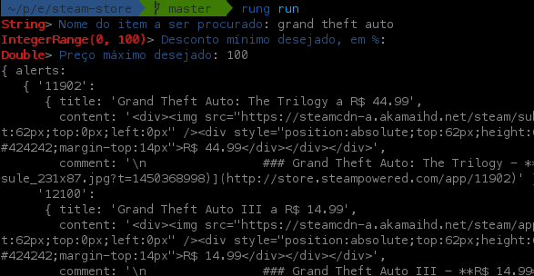

# Compilando e executando

## Compilando um app

Você pode usar o comando ``rung build`` para compilar um app
para a forma binária, gerando um arquivo ``.rung``. O binário gerado
pode então ser usado para distribuição e publicação para a loja do Rung,
mas não precisa ser gerado para rodar um app localmente, levando
em conta que o *Rung CLI* consegue atuar diretamente como um interpretador.

O binário do Rung é uma forma modificada de um arquivo PKZip. Em tempo
de compilação, a VM do Rung executa seu app para garantir que não há
erros de análise do código exportado e gera os metadados para seu app
de forma estática, para otimizar a execução.

## Executando um app

É possível testar os apps que desenvolve locamente sem a
necessidade de publicá-las para o Rung. O *Rung CLI* provê o comando
``rung run`` para isso.

É criada uma interface visual que recebe os parâmetros de entrada
e mostra o resultado obtido, os cartões que seriam gerados, para o
programador.

### Executando com locale customizado

Quando estiver testando internacionalização, pode forçar a definição
de um locale pelo próprio terminal, executando:

``RUNG_LOCALE=pt_BR rung run``

Por padrão, sem essa definição, o *Rung CLI* irá considerar o locale
padrão do seu sistema operacional.