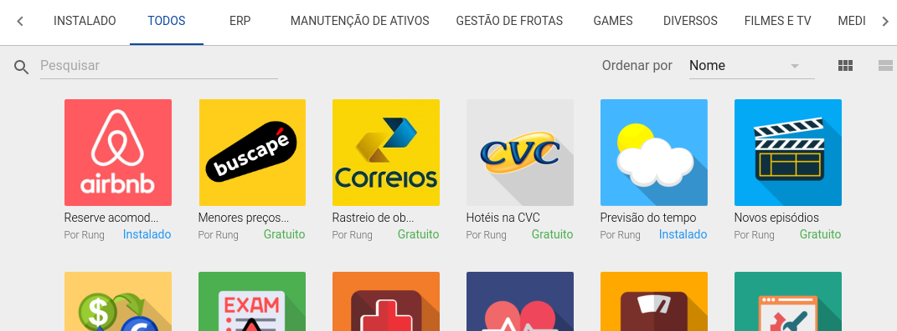

# Ícone personalizado

Ao publicar um app, o Rung tentará localizar um arquivo ``icon.png``
no seu pacote. Ele corresponde à identidade de seu app. Não é
obrigatório, mas é recomendado. Ele determina como seu app será mostrada
na Rung App Store:

