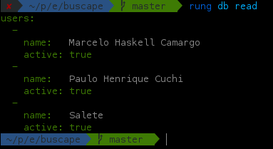

# Banco de dados

Também há suporte para micro esquema de banco de dados não-relacional.
Cada extensão pode armazenar um objeto JS que possa ser representado como JSON.
Esse objeto pode ser retornado juntamente com os alertas da extensão. Durante
a primeira execução, o valor sempre corresponde a ``undefined``.

## Exemplo de contador

```js
import { create } from 'rung-sdk';

function main(context) {
    const counter = context.db === undefined ? 0 : context.db;

    return {
        alerts: [`The value is ${counter}`],
        db: counter + 1
    };
}

export default create(main, { params: {}, primaryKey: true };
```

Cada vez que a extensão roda, o contador é incrementado. Caso ele seja
``undefined``, é inicializado como ``0``. Você pode colocar objetos de
complexidade bem maiores dentro dele.

## Comandos do rung-cli

Existem dois comandos no Rung CLI para trabalhar com banco de dados via linha
de comando:

| Comando           | Descrição                                                     |
|-------------------|---------------------------------------------------------------|
| ``rung db clear`` | Limpa toda a base de dados para a extensão ativa              |
| ``rung db read``  | Permite visualizar em formato Yaml os dados gravados no banco |

