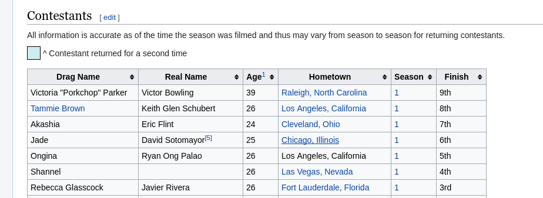

# Extraindo HTML

Esse exemplo visa mostrar a possibilidade de extrair o HTML do site que quer
obter o conteúdo e manipular o DOM fictício para poder obter os dados em
específico. Iremos criar uma extensão que gera alertas contendo os nomes
de todos os participantes do programa de TV americando _RuPaul's Drag Race_.

Estaremos usando o seguinte site como base: https://en.wikipedia.org/wiki/List_of_RuPaul%27s_Drag_Race_contestants

O conteúdo que queremos encontra-se em uma tabela no site:



É necessário conhecer o básico de seletores do DOM. Se você sabe CSS, você
provavelmente tem o conhecimento necessário para selecionar os elementos
estáticos.

A tabela que queremos possui uma classe ``.sortable``. Nós queremos pegar, do corpo da tabela cada linha e, de cada linha, o primeiro elemento. Então,
podemos montar nosso seletor como ``.sortable tbody tr > td:nth-child(1)``.
Se você abrir seu console e digitar ``document.querySelectorAll('.sortable tbody tr > td:nth-child(1)')``, verá que recebemos uma lista de nodos HTML com as informações que queremos!

A requisição para obter HTML é igual à requisição para obter JSON. Podemos usar a *Superagent* para isso, e também vamos usar uma outra dependência. Adicione o ``jsdom`` ao projeto. Usaremos ele para criar o DOM virtual!

```js

   import Bluebird from 'bluebird';
   import agent from 'superagent';
   import promisifyAgent from 'superagent-promise';
   import { JSDOM } from 'jsdom';

   const request = promisifyAgent(agent, Bluebird);
   const website = 'https://en.wikipedia.org/wiki/List_of_RuPaul%27s_Drag_Race_contestants';

```
**Uma informação importante**: quando buscamos uma **lista** de elementos do DOM,
não nos é retornado um *array* do JavaScript, mas um ``NodeList``. Existe uma
maneira de contornar isso para trabalhar com os elementos, que é converter a
lista de nodos para um *array* nativo. Podemos definir a seguinte função, baseado
[`neste link`](https://stackoverflow.com/questions/3199588/fastest-way-to-convert-javascript-nodelist-to-array):

``` js

   function nodeListToArray(dom) {
       return Array.prototype.slice.call(dom, 0);
   }
```

Agora, dentro da função principal assíncrona, precisamos extrair os dados.
Uma informação importante é que alguns dos itens da lista que precisamos
encontram-se no formato ``<a href="#">Queen</a>`` e outros no formato ``Queen``.

``` js

   function main(context, done) {
       // Obter todo o HTML do site em modo texto
       request.get(website).then(({ text }) => {
           // Virtualizar o DOM do texto
           const { window } = new JSDOM(text);
           // Converter os dados da tabela para uma lista e remover os links
           const queens = nodeListToArray(window.document.querySelectorAll('.sortable tbody tr > td:nth-child(1)'))
               .map(queen => {
                   const link = queen.querySelector('a');
                   return link === null ? queen.innerHTML : link.innerHTML;
               });

           // Agora, com `queens` contendo a lista que queremos, podemos gerar os alertas
           done({ alerts: queens });
       });
   }
```
Basicamente, é possível usar os seletores também utilizados no CSS para extrair os elementos.