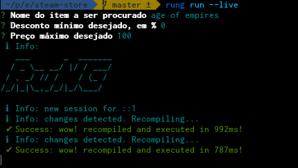

# Hot reloading

A partir da versão ``1.1.1``, o Rung CLI suporta desenvolvimento agilizado através de edição ao
vivo e compilação dinâmica. Se você está habituado a desenvolver com React, vai se sentir
familiarizado.
 

## Como configurar

Para habilitar o modo ``live``, rode sua extensão com ``rung run --live``, e preencha os valores
dos parâmetros de entrada. Nada mais é necessário. O Rung CLI irá monitorar as mudanças e
compilar dinamicamente!

## Linha do tempo

Como o estado é puro, uma linha do tempo é criada e você pode navegar pelos estados anteriores.
Quando uma mudança é detectada, uma nova era é criada e a aplicação é reposicionada para ela.

Caso você interrompa o processo e entre com novos parâmetros, não é necessário fechar o navegador
ou recarregar a página. O mesmo é válido para quando executar outra extensão. As novas entradas
serão adicionadas à linha do tempo das anteriores.

## Erros

Erros sintáticos e de *runtime* serão exibidos em uma caixa específica.

## Barra lateral

Você pode clicar nos alertas para ver o resultado da renderização do *markdown* para comentários
na barra lateral.

