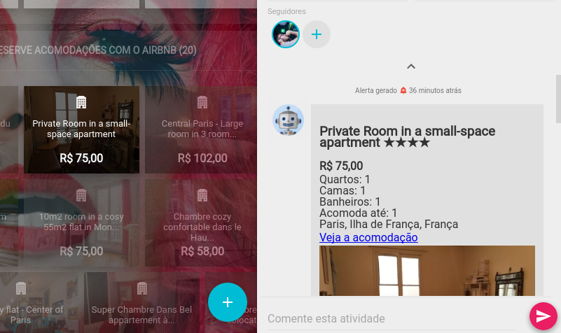

## Rung Bot

Em seus alertas, é possível programar para que haja um comentário no *follow-up*
do Rung Bot, que é, basicamente, um robô customizado que tem o objetivo de
complementar a informação do card.



O conteúdo escrito pelo Rung Bot deve
ser definido usando Markdown, e paralelo ao card customizado. Exemplo:

```js
   return {
       alerts: [{
           title: 'Bananas are cheap',
           content: render(bananasPrice),
           comment: renderComment(bananasPrice)
       }]
   };
```

```js
   function renderComment(bananasPrice) {
       return `
           # Bananas are cheap!
            The bananas are costing U$ ${bananasPrice}!!!
           Buy them now!
           
       `;
   }
```