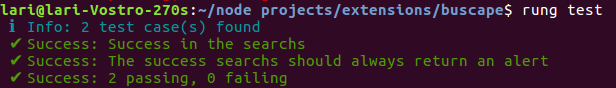
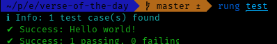
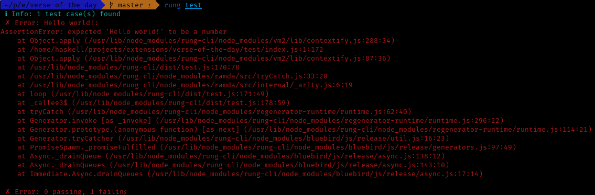
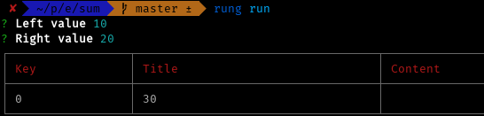

# Escrevendo testes

A partir da versão `1.4.0`, o Rung CLI provê um ferramentário para ajudar a testar seus aplicativos usando testes de integração. Quando providos, os testes são executados continuamente nos servidores do Rung para notificarmos eventuais mudanças nas APIs que poderiam quebrar os aplicativos.



## Criando um teste

O comando `rung test` irá buscar pelo arquivo `test/index.js`. Caso exista, os testes serão executados dentro do contexto da máquina virtual tornando disponível o aplicativo compilado como função. Crie um arquivo `index.js` dentro da pasta `test` para começarmos! Você pode usar as ferramentas de _assertion_ que desejar. Usaremos o `chai` nos nossos exemplos. Vamos criar nosso primeiro teste!

```js
import { expect } from 'chai'

test('Hello world!', () => {
    expect('Hello world!').to.be.a('string');
});
```

Execute `rung test` e, voilà!



Temos um teste passando! Se alterarmos:

```diff
-   expect('Hello world!').to.be.a('string');
+   expect('Hello world!').to.be.a('number');
```

Teremos:



## Testes assíncronos

Para executar testes que dependem de requisições de rede ou do aplicativo, suportamos que os casos de teste retornem _promises_ para serem computadas. Todo aplicativo compilado é uma _promise_ e é passado como parâmetro em cada caso de teste. Vamos escrever uma extensão que nada faz além de computar a soma de 2 números, mas com um atrasado provocado.

**index.js**
```js
import { create } from 'rung-sdk'
import { Integer } from 'rung-cli/dist/types'

function main(context, done) {
    const { left, right } = context.params
    setTimeout(() => {
        done({
            alerts: [{
                title: left + right
            }]
        })
    }, 2000)
}

export default create(main, {
    params: {
        left: {
            description: 'Left value',
            type: Integer
        },
        right: {
            description: 'Right value',
            type: Integer
        }
    }
})
```

Executando com `rung run`:



Adicionamos o `chai` como dependência de desenvolvimento:

`yarn add --dev chai`

Então, podemos escrever nosso teste:

**test/index.js**
```js
import { expect } from 'chai'

test('Sum works!', app => {
    return app({ params: { left: 50, right: 150 } })
        .then(result => {
            expect(result.alerts).to.be.an('array')
            expect(result.alerts).to.have.length(1)
            expect(result.alerts[0].title).to.equals(200)
        })
})
```

Execute `rung test` e _gotcha_, podemos testar nossa aplicação compilada!