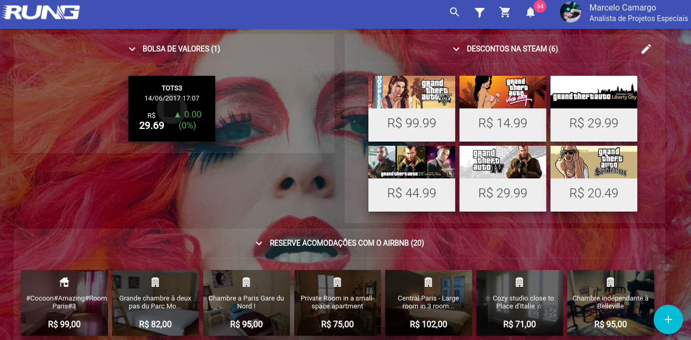

.. _custom_cards:

====================
Cards personalizados
====================

Além de texto plano, o Rung permite que os cards possam ter um subset de HTML
personalizado para cada extensão. O compilador de extensões do Rung possui
suporte direto a JSX, permitindo que o conceito do React seja aplicado aos
cards em tempo de compilação.

---
JSX
---

Ao invés de definir o HTML como string, utilize-o diretamente na renderização.
Também há suporte a folha de estilos como objetos dentro das tags
Exemplo de extensão customizada:

.. code-block:: javascript

   import { create } from 'rung-sdk';

   const styles = {
       name: {
           fontWeight: 'bold',
           color: 'red'
       }
   };

   function render(name) {
       return (
           

               Hello, { name }
           

       );
   }

   function main(context) {
       return {
           alerts: [{
               title: 'Betty',
               content: render('Betty')
           }]
       };
   }

    export default create(main, { params: {}, primaryKey: true };

-------
Preview
-------