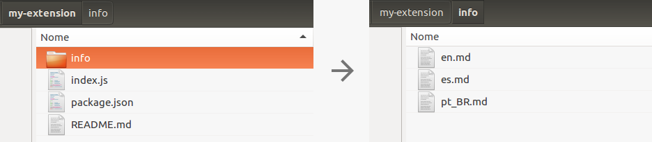

.. _resources:

======================
Informações adicionais
======================

Atualmente, o Rung possibilita que o desenvolvedor defina, além da descrição, um conteúdo adicional (no formato markdown) a ser apresentado na página da sua extensão na loja. Este conteúdo adicional é opcional, mas é recomendado o seu uso de tal forma que o seu conteúdo instigue o usuário a instalar e utilizar a extensão.

O conteúdo adicional deve ser estruturado dentro da pasta ``info`` e pode ser definido em inglês (en), português (pt_BR) e espanhol (es), conforme imagem abaixo.

